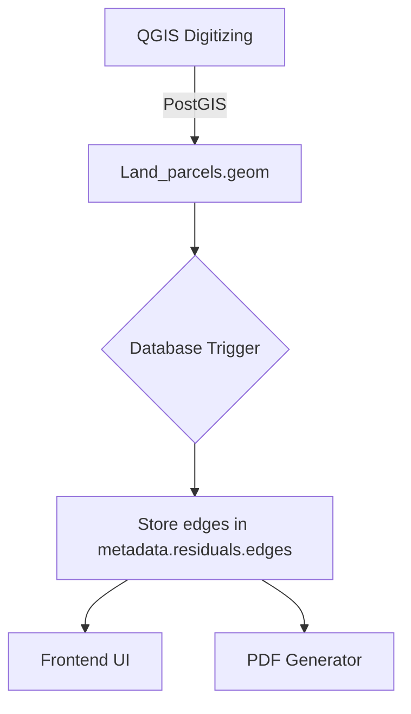

# Unified Edge Data Solution for QGIS-to-PDF Workflow

## Architecture Overview


## Core Components

### 1. Automatic Edge Calculation (Database Layer)
```sql
CREATE OR REPLACE FUNCTION calculate_parcel_edges()
RETURNS TRIGGER AS $$
BEGIN
  -- Extract vertices and calculate edges
  -- Store as structured JSON in metadata column
  RETURN NEW;
END;
$$ LANGUAGE plpgsql;

CREATE TRIGGER trg_calculate_edges
AFTER INSERT OR UPDATE OF geom ON land_parcels
FOR EACH ROW EXECUTE FUNCTION calculate_parcel_edges();
```

### 2. API Endpoint
`GET /api/parcels/:id/edges`
- Returns pre-calculated edge data from metadata
- Consistent format for UI and PDF

### 3. Frontend Integration
- New EdgeDetailsView.vue component
- Real-time display from metadata
- Sync with PDF generator

### 4. PDF Generation
- Uses same edge data from metadata
- Fallback to on-demand calc if needed

## Implementation Steps
1. [ ] Database trigger implementation
2. [ ] Backend API endpoint
3. [ ] Frontend edge display
4. [ ] PDF integration
5. [ ] Testing workflow

## Expected Output
```json
"metadata": {
  "residuals": {
    "edges": [
      {
        "from": "A", 
        "to": "B",
        "distance": 12.345,
        "bearing": 300.22
      }
    ]
  }
}
```
